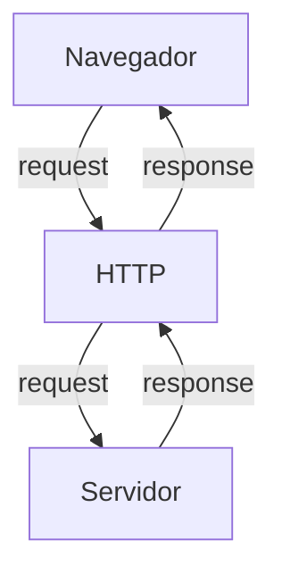
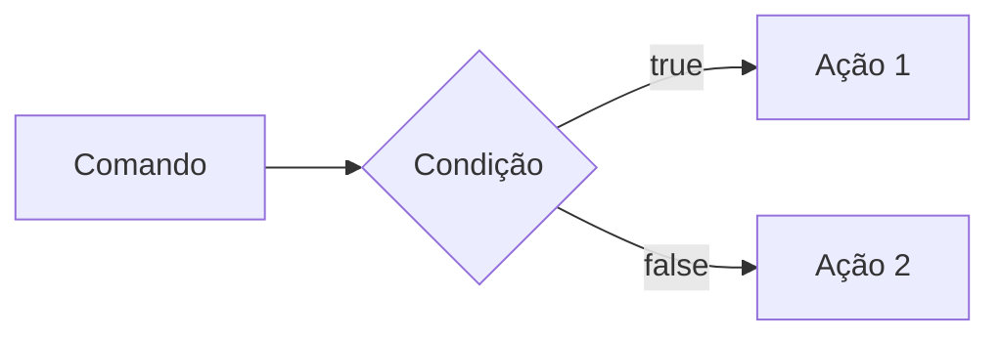
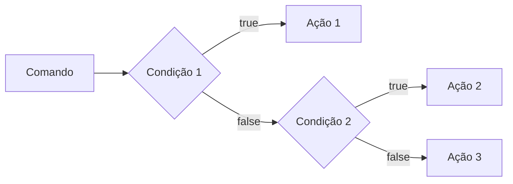
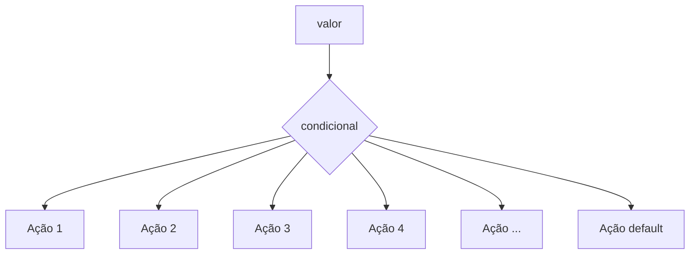

# Curso BackEnd - 225h - Técnico em Desenvolvimento de Sistemas - SENAI

Profº Diogo TB

Escola SENAI Americana

2º Semestre 2026

## Objetivos do Curso

- Desenvolver Aplicações web Server Side, utilizando a linguagem PHP;
- Aplicar Sisntaxe Nativa PHP (Vanilla);
- Manipulação HTTP;
- Persistência de Dados;
- Segurança contra SQL Injection/CSRF;
- Refatoração em POO (Programação Orientada ao Objeto);
- Arquitetura MVC (Model, View, Controller);
- Utilização do FrameWork Laravel; 

obs: framework - um conjunto de bibliotecas que oferecem uma solução completa para o desenvolvimento de alguma coisa

## Cronograma do Semestre

Carga Horária: 105h 1º Semestre e 120h 2º Semestre

Duração: 20 Semanas 1º Semestre e 20 Semanas 2º Semestre

---

### Semana 1: Introdução ao BackEnd e Configuração do Ambiente PHP

#### O que é BackEnd?

O back-end é a parte de uma aplicação que o usuário não vê, mas que faz tudo funcionar por trás das telas.

O Back-End é a parte de um sistema que funciona nos servidores, sendo responsável por executar a lógica da aplicação, processar informações e armazenar dados. 

Além disso, o BackEnd é responsável por atender ás solicitações do Frontend.

**Sobre o mercado atual:** o cenário é bom, mas mais exigente do que era. Quem conhece só o básico enfrenta mais concorrência. Quem alia backend sólido com IA aplicada, cloud e inglês está num patamar completamente diferente — vagas internacionais remotas são uma realidade pra esse perfil.

O Backend é formado pelo servidor, banco de dados, lógica de programação com APIs e linguagens de programação/frameworks. Esses componentes trabalham juntos para processar dados, armazenar informações e garantir o funcionamento da aplicação.

**Para que serve**

- Processar lógica de negócio: regras, cálculos, validações (ex: calcular frete, aplicar desconto, validar login)
- Gerenciar banco de dados: salvar, buscar, atualizar e deletar informações
- Autenticação e autorização: controlar quem pode acessar o quê (login, senhas, permissões)
- Fornecer APIs: criar "pontes" (endpoints) para o frontend ou outros sistemas consumirem dados
- Integração com serviços externos: pagamentos, e-mails, notificações, APIs de terceiros
- Segurança: proteger dados sensíveis, evitar ataques (SQL injection, XSS, etc.)
- Escalabilidade e performance: garantir que o sistema aguente muitos usuários ao mesmo tempo.


**Principais Tecnologias Linguagens de programação:** 
Ferramentas usadas para escrever o código do servidor, como Python, Node.js (JavaScript), Java e PHP.APIs: Os "caminhos" que permitem que o que você vê no celular converse com o servidor.

**Areas de Atuação**
- Fintechs e Bancos
- Segurança, transações, alta escala 
- E-commerce
- Catálogo, pedidos, pagamentos
- Healthtechs
- Prontuários, telemedicina
- SaaS / Startups
- Backend é o coração do produto
- Logística
- Rastreio, rotas, tempo real
- Educação
- Plataformas, conteúdo, usuários

#### O Ciclo de Vida da Requisição HTTP

##### O que é HTTP?

*HTTP*, Hypertext Transfer Protocol, é um protocolo de comunicação utilizado para transferência de informações na WWW (World wide Web) e em outros sistemas de redes.

O HTTP é a base para que o cliente e um servidor web troquem informações. Ele permite a requisição e a resposta de recurso como, imagens, arquivos e textos.




#### Como Funciona na Prática o BackEnd

- **Ação do Usuário**: Envia uma Solicitação pela UI(Interface do Usuário). Exemplo de UI: Tela do Celular, Navegador da Internet, Alexa, IOT ...
- **Enviar uma Requisição**: A UI transforma ação do Usuário em uma Requisição HTTP.
- **O Processamento BackEnd**: O Código BackEnd recebe o pedido, valida os dados e decide o que fazer. Ex: consultar uma informação no BD(Base de Dados).
- **Resposta**: O servidor devolde o resultado para a UI. Ex: Um Login Autorizado, Confirmação de uma Compra...

#### Tipos de Requisição HTTP

Os tipos de requisição HTTP indicam a ação que o usuário deseja executar no servidor. As principais ações são:

- **GET**: Pede dados de um lugar especifico do servidor. "Não Faz Alterações no Servidor"
- **DELETE**: Apaga um Dados do Servidor.
- **POST**: Envia dados novo para *criar* algo ou processar informações no servidor.
- **PUT/PATCH**: Modificaar um dados já existente. 

---

#### Iniciando o PHP

**PHP** (HyperText PreProcessor) é uma linguagem de programação interpretada e open source, focada no desenvolvimento de sistemas para web, pode ser usada junto com HTML para criação de páginas web dinâmicas.

O PHP de fato é yma das linguagens de programação mais populares da atualidade. Ela permite que você crie aplicações web robustas, de uma muito simplificada e direta. A linguagem tem diversos recursos que facilitam e aceleram o ´processo de desenvolvimento de sites e sistemas para web. E além od mais, ela ainda tem um ótimo ecossistema, uma excelente comunidade e um grande mercado de trabalho.

##### Instalando o PHP

- Fazer o Download do PHP (php.net)
- ZIP - NTS(Non Thread Safe) 8.5
- Descompactar o Arquivo do PHP na pasta C:\src\php (Para Descompactar usar o 7Zip = Melhor) => nunca salvar arquivo ou programas na raiz do sistema(C:)
- Adicionar a Pasta do PHP(C:\src\php) as Variáveis de Ambiente do Sistema (PATH)
- Verificar a Instalação rodando o comando *php --version*

##### Criando Minha Primeira Aplicação em PHP

1. Antes de começar da Codar:

- Preparar meu VSCODE
    - Criar um Profile próprio para PHP
    - Instalar Extensões Necessária para Transformar o VSCode em uma IDE:
        - PHP Intelephense => permite a utilização de Snippets(atalhos de Código)
        - PHP Debug => ajuda a encontrar erros de código
        - PHP Cs Fixer => formatação de códigos (Identação)
        - PHP Server => ajuda na criação de um servidor local para PHP
    - Desabilitamos o PHP Nativo do VsCode ( @builtin PHP)

2. Hello World (muito importante)

### Semana 2 - Variáveis, Constantes e Operadores em PHP

#### Estudo de Variáveis e Constantes em PHP

Declarar variávies é alocar um espaço na memória que permite a inclusão e manipulação de dados. 

**Variávies**

- devem ser declaradas usando "$" antes do nome da variável
- são não tipadas ( não precisa declarar o tipo dela na criação) , 
- podem ser String, Numéricas ( interger e float), Booleanas  e Nulas. Não Permite declaração de Undefined
- Usar o "declare(Strict_types=1);" na primeira linha do arquivo; => blinda o sistema contra conflitos de tipos de variáveis

**Constantes**

- não poodem ser mudadas ou redeclaras após a criação
- pode ser criada usando "const" ou "define"
- não permite interpolação


#### Estudo de Operadores

**Aritméticos**: São usados para realizar Cálculso

| Operador | Nome | Exemplo | Resultado |
| - | - | - | - |
| + | Adição | 10+5 | 15 |
| - | Subtração | 10-5 | 5 |
| * | Multiplicação | 10*5 | 50 |
| / | Divisão | 10/5 | 2 |
| % | Modulo(Resto) | 10%3 | 1 (10 div 3 da 3, sobra 1) |
| ** | Expoente | 2**3 | 8(2 elevado a 3) |

obs: O Operador % é o melhor amigo de um programador , permite ordenar listas e organizar fila e pilhas

**Relacionais**:  Permite o Relacionamento entre dois ou mais valores, o resultado de uma operação é sempre uma booleana (verdadeiro ou falso).

| Operador | Significado | Exemplo | Resultado |
| - |  - | - | - |
| > | Maior que | 18 > 18 | false |
| >= | Maior ou igual a | 18 >= 18 | true |
| < | Menor que | 10 < 20 | true |
| <= | Menor ou igual a | 10 <=5 | false |
| == | Comparação de Valor | "10"==10 |  true |
| === | Comparação Estrita | "10"===10 | false |
| != | Diferente | "10"!=10 | false |
| !== | Estritamente Diferente | "10"!==10 | true | 


**Lógicos**: Permite a Combinação entre sentenças. 

- Operador AND (E) => && : para o resultado ser verdadeiro, Todas as Combinações precisam ser verdadeira
    - true && true => true
    - true && false => false

- Operador OR (OU) => || : para o resultado ser verdadeiro, Basta apenas uma condição ser verdadeira
    - false || true => true
    - false || false => false

- Operador NOT (Não) => ! : Inverte a lógica da Operação, 
    - !true => false
    - !false => true

---

### Semana 3 - Estrutura de Controle de Dados (Condicionais e Repetição)

- **Conteudo**: Estrutura `if`,`else`,`elseif`, operadores ternarios, `match` => substituto do `switch/case`, loops `for`,`while`, `do-white` e `foreach`

#### Estruturas de Controle da Dados Ajudam no Processo de Automatização em Programas e Sistemas

##### Condicionais (IF, ELSE, ELSEIF)

**Formas de Uso**

- uso do `if` apenas:
Exemplo: aplicar desconto de 10% em compras acima de 100 Reais;

```mermaid

graph LR

A[Comando] --> {Condição} --> C[Ação]

```

```php

if($valorCompra > 100){
    $valorFinal = $valorCompra * 0.09;
}

```
- Uso do `if`e do `else`
Exemplo: Aplicar um desconto de 10% para compras acima de 100reais e 5% para as demais compras



```php

if($valorCompra > 100){
    $valorFinal = $valorCompra * 0.9;
} else {
    $valorFinal = $valorCompra * 0.95;
}

```

- Uso `elseif` (If Encadeado) => estrutura usada para manipulaçao de dados em duas ou mais condicionais.
Exemplo: Compras acima de R$200 tem 15% de desconto, compras acima de R$100 tem 10% de desconto e demais compras tem 5% de desconto



```php

if($valorCompra > 200){
    $valorFinal = $valorCompra * 0.85;
} elseif ($valorCompra > 100) {
    $valorFinal = $valorCombra * 0.9;
} else {
    $valorFinal = $valorCompra * 0.95;
}

```

*obs*: sempre usar `elseif` para situaçoes que precisam de mais de uma condição, ou seja, fazer encadeamento das comdições 

- Uso *ERRADO* do if

```php

if($valorCompra > 200) {
    $valorFinal = $valorCompra * 0.85;
}
if($valorCompra > 100) {
    $valorFinal = $valorCompra * 0.9;
} else {
    $valorFinal = $valorCompra * 0.95;
}

```

##### Operadores Ternários

Um atalho para a estrutura condicional `if/else, normalmente escrito em uma única linha de código.

` condição ? verdadeira : falsa `

Perfeito para decisões curtas de uma linha de comando

Exemplo: Verificar se a pessoa é maior de idade (18);

```php

$idade = 20;
//O formato é (condição) ? Verdadeiro : falso;

$status = ($idade>=18) ? "Maior de Idade" : "Menor de Idade";
$status2 = ($idade>=60) ? "Idoso" : ($idade>=18) ? "Adulto" : "Criança" ;

echo $status //

```
##### Expressão Condicional `match` (PHP 8)

No mercado atual de PHP, não se uma mais uma `Switch/Case` para chegar valores fixos, usa-se o `match`. Ele compara um valor e retoran diretamente o resultado caso atenda a condição.


Exemplo: Selecionar o Dia da semana a partir de um Número 

```php

$diaSemanaUm = date("w"); // pega o dia da semana em formato numerico

$nomeDiaSemana = match($diaSemanaUm) {
    "0" => "Domingo",
    "1" => "Segunda",
    "2" => "Terça",
    "3" => "Quarta",
    "4" => "Quinta",
    "5" => "Sexta",
    "6" => "Sábado",
    "default" => "Dia Inválido"
};

echo " Hoje é $nomeDiaSemana";

```