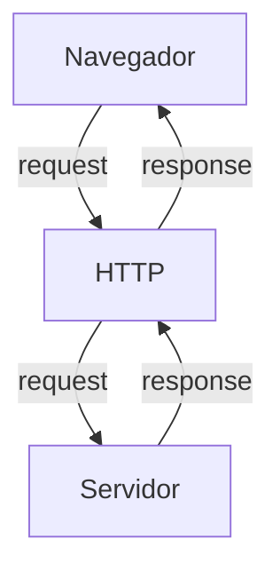

# Curso BacKend - 225h - Técnico em Desenvolvimento de Sistemas - SENAI

prof Diogo TB

Escola SENAI Americana

2 Semestre 2026

## Objetivo do Curso

- Desenvolver Aplicações web Servr Side, utilizando a linguagem PHP;
- Aplicar Sistaxe Nativa PHP (Vanilla);
- Manipulação HTTP;
- Persistência de Dados;
- Segurança contra SQL Injection/CSRF;
- Refatoração em POO (Programação Orientada ao Objeto);
- Arquitetura MVC (Model, View, Controller);
- Utilização do FrameWork Laravel;

obs: framework - um conjunto de bibliotecas que oferecem uma solução completa para o desenvolvimento de alguma coisa

## Cronograma do Semestre

Carga Horária: 105h 1 Semestre e 120h 2 Semestre

Duração: 20 semanas 1 semestre e 20 semanas 2 semestre

---

### Semana 1: Introdução ao BackEnd e Configuração do Ambiente PHP

### O que é Backend?

O back-end é a parte de uma aplicação que o usuário nao vê, mas que faz tudo funcionar por trás das telas.

O Back-End é a parte de um sistema que funciona nos servidores, sendo responsável por executar a lógica da aplicação, processar informações e armazenar dados.

Além disso, o Back-end é responsável por atender ás solicitações do frontend.

sobre o mercado atual: o cenário é bom, mas mais exigente do que era. Quem conhece só o básico enfrenta mais concorrência. Quem alia Backend sólido com IA aplicada, cloud e inglês está num patamar completamente diferente - vagas internacionais remotas são uma realidade pra esse perfil.

O Backend é formado pelo servidor, banco de dados, lógica de programação com APIs e linguagens de programação/frameworks. Esses componentes trabalham juntos para processar dados, armazenar informações e garantir o funcionamento da aplicação.

# Para que serve
-Processar lógica de negócio: regras, cálculos, validações (ex: calcular frete, aplicar desconto, validar login)

-Gerenciar banco de dados: salvar, buscar, atualizar e deletar informações

-Autenticação e autorização: controlar quem pode acessar o quê (login, senhas, permissões)

-Fornecer APIs: criar "pontes" (endpoints) para o frontend ou outros sistemas consumirem dados

-Integração com serviços externos: pagamentos, e-mails, notificações, APIs de terceiros

-Segurança: proteger dados sensíveis, evitar ataques (SQL injection, XSS, etc.)

-Escalabilidade e performance: garantir que o sistema aguente muitos usuários ao mesmo tempo.

# Principais Tecnologias Linguagens de programação:
Ferramentas usadas para escrever o código do servidor, como Python, Node.js (JavaScript), Java e PHP.APIs: Os "caminhos" que permitem que o que você vê no celular converse com o servidor.

Fintechs e Bancos
Segurança, transações, alta escala 

E-commerce
Catálogo, pedidos, pagamentos

Healthtechs
Prontuários, telemedicina

SaaS / Startups
Backend é o coração do produto

Logística
Rastreio, rotas, tempo real Educação

#### Oque é HTTP?

*HTTP* hypertext transfer protocol, é um protocolo de comunicação utilizado para transferência de informações na www (World wide web) e em outros sistemas de redes.

o HTTP é a base para que o cliente e um servidor web troquem informações. Ele permite a requisição e a respostas de recursos como, imagens, arquivos e textos.

#### Como Funciona na Prática o BackEnd

- **Ação do Usuário**: Envia uma Solicitação pela UI(Interface do Usuário). Exemplo de UI: Tela do Celular, Navegador da Internet, Alexa, IOT ...
- **Enviar uma Requisição**: A UI transforma ação do Usuário em uma Requisição HTTP.
- **O Processamento BackEnd**: O Código BackEnd recebe o pedido, valida os dados e decide o que fazer. Ex: consultar uma informação no BD(Base de Dados).
- **Resposta**: O servidor devolde o resultado para a UI. Ex: Um Login Autorizado, Confirmação de uma Compra...

#### Tipos de Requisição HTTP

Os tipos de requisição HTTP indicam a ação que o usuário deseja executar no servidor. As principais ações são:

- **GET**: Pede dados de um lugar especifico do servidor. "Não Faz Alterações no Servidor"
- **DELETE**: Apaga um Dados do Servidor.
- **POST**: Envia dados novo para *criar* algo ou processar informações no servidor.
- **PUT/PATCH**: Modificaar um dados já existente. 

---

#### Iniciando o PHP

**PHP** (HyperText PreProcessor) é uma linguagem de programação interpretada e open source, focada no desenvolvimento de sistemas para web, pode ser usada junto com HTML para criação de páginas web dinâmicas.

O PHP de fato é yma das linguagens de programação mais populares da atualidade. Ela permite que você crie aplicações web robustas, de uma muito simplificada e direta. A linguagem tem diversos recursos que facilitam e aceleram o ´processo de desenvolvimento de sites e sistemas para web. E além od mais, ela ainda tem um ótimo ecossistema, uma excelente comunidade e um grande mercado de trabalho.

##### Instalando o PHP

- Fazer o Download do PHP (php.net)
- ZIP - NTS(Non Thread Safe) 8.5
- Descompactar o Arquivo do PHP na pasta C: \src\php (Para Descompactar usar o 7Zip = Melhor) => nunca salvar arquivo ou programas na raiz do sistema(C:)
- Adicionar a Pasta do PHP(C:\src\php) as Variáveis de Ambiente do Sistema (PATH)
- Verificar a Instalação rodando o comando *php --version*

##### Criando Minha Primeira Aplicação em PHP

1. Antes de começar da Codar:

- Preparar meu VSCODE
    - Criar um Profile próprio para PHP
    - Instalar Extensões Necessária para Transformar o VSCode em uma IDE:
        - PHP Intelephense => permite a utilização de Snippets(atalhos de Código)
        - PHP Debug => ajuda a encontrar erros de código
        - PHP Cs Fixer => formatação de códigos (Identação)
        - PHP Server => ajuda na criação de um servidor local para PHP
    - Desabilitamos o PHP Nativo do VsCode ( @builtin PPHP)

2. Hello World (muito importante)

##### Estudo de Variáveis e Constantes em PHP

Declarar variávies é alocar um espaço na memória que permite a inclusão e manipulação de dados. 

**Variávies**

- devem ser declaradas usando "$" antes do nome variável
- são não tipadas ( não precisa declarar o tipo dela na criação) ,
- podem ser String, Numéricas (interger e float), Booleanas e Nulas.
Não permite declaração de Undefined
- Usar o "declare(Strict_types=1); na primeira linha do arquivo; => blinda o sistema contra conflitos de tipos de variáveis

**Constantes**

- não poodem ser mudadas ou redeclaras após a criação
- pode ser criada usando "const" ou "define"
- não permite interpolação

##### Estudos de Operadores

**Aritméticos**: São usados para realizar Cálculso

| Operador | Nome | Exemplo | Resultado |
| - | - | - | - |
| + | Adição | 10+5 | 15 |
| - | Subtração | 10-5 | 5 |
| * | Multiplicação | 10*5 | 50 |
| / | Divisão | 10/5 | 2 |
| % | Modulo(Resto) | 10%3 | 1 (10 div 3 da 3, sobra 1) |
| ** | Expoente | 2**3 | 8(2 elevado a 3) |

obs: O Operador % é o melhor amigo de um programador, permite ordenar listas e organizar fila e pilhas

**Relacionais**: Permite o Relacionamento entre dois ou mais valores, o resultado de uma operação é sempre uma booleana (Verdadeiro ou Falso).

| Operador | Significado | Exemplo | Resultado |
| - | - | - | - |
| > | Maior que | 18 > 18 | false |
| >= | Maior ou igual a | 18 >= 18 | true |
| < | Menor que | 10 < 20 | true |
| <= | Menor ou igual a | 10 <=5 | false |
| == | Comparação de valor | "10"==10 | true |
| === | Comparação Estrita | "10"===10 | false |
| != | Diferente | "10"!=10 | false |
| !== | Estritamente Diferente | "10"!==10 | true |

**Lógicos**: permite a combinação entre sentenças.

- Operador AND (E) => && : para o resultado ser verdadeiro, todas as combinações precisam ser verdadeiras
   - true && true => true
   - true && false => false

   - Operador OR (OU) => || : para o resultado ser verdadeiro, Basta apenas uma condição ser verdadeira 
   - false || true => true
    - false || false => false

- Operador NOT (Não) => ! : Inverte a lógica da Operação, 
    - !true => false
    - !false => true